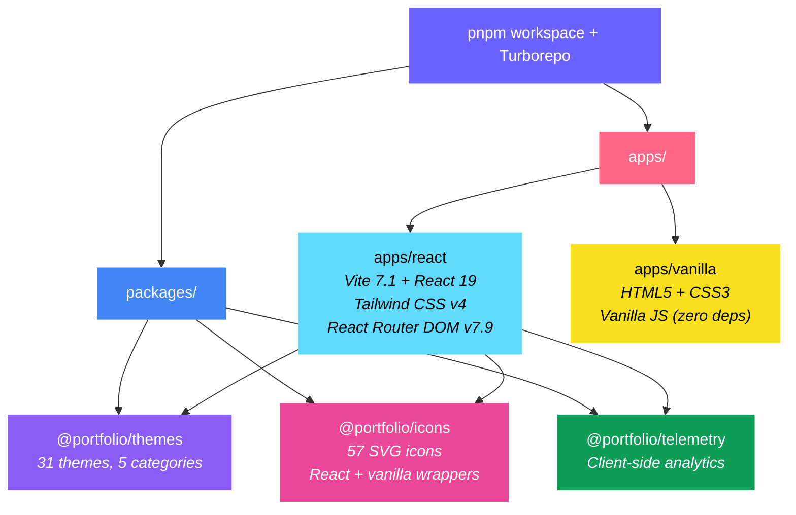

# DevFest Portfolio Workshop

A **multi-track workshop platform** for building personal portfolio websites. Features 5 learning tracks, 31 hand-crafted themes, interactive lessons with live playgrounds, quizzes, coding challenges, and a cinematic slide presentation system — all in one monorepo.

> Built for [GDG DevFest](https://devfest.withgoogle.com/) workshops. Works great for meetups, classrooms, and self-paced learning.

---

## Highlights

- **5 learning tracks** — React 19, Vanilla JS, Vue 3, SvelteKit, and Agentic Dev
- **31 themes** across 5 categories (Anime, Modern, Nature, Classic, DevFest)
- **57 SVG icons** with React and vanilla JS wrappers
- **Interactive lessons** with embedded code playgrounds
- **Coding challenges** and **knowledge quizzes** with progress tracking
- **Cinematic workshop slides** built right into the app
- **Zero-dependency vanilla starter** — works by double-clicking `index.html`
- **Achievement system** with unlockable rewards
- **Dark mode** + keyboard shortcuts (`D` to toggle, `?` for help)

---

## Quick Start

### Prerequisites

| Tool | Version |
|------|---------|
| [Node.js](https://nodejs.org/) | ≥ 18.0.0 |
| [pnpm](https://pnpm.io/) | ≥ 8.0.0 |

### Setup

```bash
# Clone the repo
git clone https://github.com/ShugKnight24/devfest_portfolio_workshop.git
cd devfest_portfolio_workshop

# Install dependencies
pnpm install

# Start all dev servers
pnpm dev
```

The React app will be available at **http://localhost:3000**.

For the vanilla starter, just open `apps/vanilla/index.html` in your browser — no build step needed.

---

## Architecture



### Monorepo Structure

```
devfest_portfolio_workshop/
├── apps/
│   ├── react/            # React 19 workshop app (Vite + Tailwind v4)
│   └── vanilla/          # Zero-dependency HTML/CSS/JS starter
├── packages/
│   ├── themes/           # 31 shared themes via CSS custom properties
│   ├── icons/            # 57 SVG icons with React & vanilla exports
│   └── telemetry/        # Client-side analytics & event tracking
├── turbo.json            # Turborepo task pipeline
├── pnpm-workspace.yaml   # Workspace configuration
└── package.json          # Root scripts & shared devDependencies
```

### React App Architecture

- **Provider tree**: `ThemeProvider` → `ToastProvider` → `AchievementProvider` → `ChallengeProvider` → `QuizProvider` → `App`
- **Routing**: React Router DOM with 17 routes (including dynamic `/lessons/:lessonId`)
- **Component variant pattern**: Each section (Header, About, Skills, Projects, Footer) has a wrapper that selects from multiple visual variants
- **Data-driven**: Single `portfolioData.js` drives the entire UI
- **Theme engine**: 31 themes via CSS custom properties, persisted to `localStorage`
- **Config**: `layout.js` (variant selection), `themes.js` (color definitions)

### Vanilla Starter

- **Zero dependencies** — works by opening `index.html` directly
- **In-page anchors** — `#hero`, `#about`, `#skills`, `#projects`, `#contact`
- **Same data structure** as the React version
- **Parallel workshop experience** — Parallel experience planned; currently a barebones starter with 5 themes

---

## Available Tracks

| Track | Lessons | Difficulty | Estimated Time |
|-------|---------|------------|----------------|
| **React 19** | 12 | Intermediate | 60–90 min |
| **Vanilla JS** | 10 | Beginner | 45–60 min |
| **Vue 3** | 10 | Intermediate | 60 min |
| **SvelteKit** | 10 | Advanced | 45 min |
| **Agentic Dev** | 10 | All Levels | 60–90 min |

Each track includes step-by-step lessons, interactive code playgrounds, quizzes at key checkpoints, and coding challenges to reinforce learning.

---

## Themes

31 themes organized into 5 categories:

| Category | Themes | Examples |
|----------|--------|----------|
| **Anime** | 11 | Pochita, Six Eyes, Vegeta, Divergent Fist |
| **Modern** | 6 | Neon Night, Synthwave, Ocean Breeze, Midnight Purple |
| **Nature** | 1 | Forest Zen |
| **Classic** | 8 | Monochrome, GitHub, Crimson Steel, Golden City |
| **DevFest** | 5 | Speed of Thought, Google I/O, DevFest Coral |

All themes use CSS custom properties and support both light and dark modes.

---

## For Workshop Facilitators

| Route | Purpose |
|-------|---------|
| `/` | Landing page & track selector |
| `/slides` | Cinematic workshop presentation |
| `/lessons` | Interactive lesson viewer |
| `/dashboard` | Student progress tracking |
| `/components` | Component playground & preview |
| `/showcase` | Visual variant gallery |
| `/quiz` | Knowledge check quizzes |
| `/challenges` | Timed coding challenges |
| `/achievements` | Gamification & unlockables |
| `/resources` | Curated developer resources |
| `/help` | Troubleshooting common issues |

### Tips

- Use `/slides` for the main presentation flow — it includes transitions and speaker notes
- Open `/dashboard` on a second screen to monitor student progress
- Point students to `/help` if they run into common setup issues
- The `/showcase` page is great for inspiring students with different design possibilities

---

## Commands

### Root (Turborepo)

```bash
pnpm dev          # Start all dev servers in parallel
pnpm build        # Production build for all apps
pnpm test         # Run all test suites
pnpm lint         # Lint all packages
```

### React App

```bash
cd apps/react
npm run dev             # Dev server (port 3000)
npm run build           # Production build
npm run test            # Run tests (watch mode)
npm run test:run        # Run tests (CI mode)
npm run test:coverage   # Coverage report
npm run preview         # Preview production build
```

### Vanilla Starter

```bash
# No build step required!
# Just open apps/vanilla/index.html in your browser
# Works via file:// protocol — no server needed
```

---

## Tech Stack

| Layer | Technology | Version |
|-------|------------|---------|
| **Runtime** | Node.js | ≥ 18.0.0 |
| **Package Manager** | pnpm | ≥ 8.0.0 |
| **Monorepo** | Turborepo | ^2.3.3 |
| **Framework** | React | ^19.2.0 |
| **Build Tool** | Vite | ^7.1.12 |
| **Styling** | Tailwind CSS | ^4.1.16 (v4) |
| **Routing** | React Router DOM | ^7.9.6 |
| **Testing** | Vitest + Testing Library + happy-dom | ^4.0.15 |
| **Analytics** | Vercel Analytics + Speed Insights | ^1.5.0 / ^1.2.0 |
| **Deployment** | Vercel (SPA rewrite rules) | — |

---

## Verification

Every change must pass:

```bash
cd apps/react && npm run build       # Clean production build
cd apps/react && npm run test:run    # All tests pass
```

The vanilla starter must load correctly in the browser via `file://` protocol.

---

## Contributing

We welcome contributions! Please follow these guidelines:

### Commit Convention

Use [Conventional Commits](https://www.conventionalcommits.org/):

```
feat: add new lesson on CSS Grid
fix: correct theme color in dark mode
refactor: simplify provider tree setup
docs: update README with new tracks
chore: bump Vite to 7.1.12
```

### Code Style

- **Semantic HTML** — `<main>`, `<nav>`, `<article>`, `<section>`
- **CSS custom properties** for all theming
- **`const` by default**, `let` only when reassignment is needed
- **Arrow functions** for component handlers
- **Destructured props** in React component signatures
- **Optional chaining** (`?.`) and **nullish coalescing** (`??`)
- **Unique IDs** on all interactive elements
- **Preserve existing comments** and docstrings

### Before Submitting a PR

1. Run `pnpm build` — must complete without errors
2. Run `pnpm test` — all tests must pass
3. Verify the vanilla starter loads via `file://` protocol
4. Keep commits atomic — one logical change per commit

---

## License

MIT © [Shug Knight](https://github.com/ShugKnight24)
